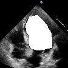
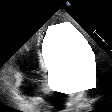
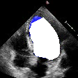
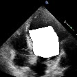
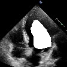
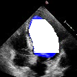
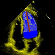

## EchoNet Function Evaluation:<br/>Quantifying Model Variation in Assessing Cardiac Function

An automated end-to-end pipeline for  
1) assessing cardiac function
2) quantifying error in left ventricular ejection fraction calculation with slight clinical perturbations

## Dataset
We simulated errors and ran calculations on 10,032 echocardiogram images which were gathered from EchoNet-Dynamic (https://echonet.github.io/dynamic/)

## Examples
We show examples of our different systematic variation of cardiac function assessment. The error opportunities showcased are over/under tracing of the left ventricle, rotations of main longitudinal axis, foreshortened apex and mitral valve annulus level foreshortening. No human tracings for these patients were used.

| Normal Tracing | Over/Under<br/> Tracing | Angle Rotations | Main Axis<br/> Foreshortening |
|---------------------------------| ----------------------------------   | -------------------------------- | ------------------------------ |
|  |  |  |  |
|                                              |  |  |  |


## Installation
First, clone this repository and enter the directory by running:
```
git clone https://github.com/douyang/echonet-function-evaluation
cd echonet-function-evaluation
```

EchoNet-Function-Evaluation is implemented for Python 3, and depends on the following packages:
* NumPy
* Matplotlib
* Pandas
* OpenCV
* Pillow
* SciPy
* tqdm

The dependencies can be installed by navigating to the cloned directory and running:
```
pip install --user .
```

## Usage
### Setting Path to Data
By default, the pipeline assumes that a copy of the data is saved in a folder named ```EchoData/``` in this directory. This path can be changed by setting an absolute path in the file named ```data.cfg``` (an example is given in the file already).

### Running Code
The pipeline has two main tasks: assessing cardiac function and quantifying variation on left ventricle ejection fraction calculations. Each of these tasks can be run with the scripts below.

#### Predicting Cardiac Timings
```
cmd="import echofunctions; echofunctions.timing_predictions.gatherTimingPredictons(inputFolder=\"Videos-Segmented\",
                                                            outputFolder=\"all_frames\", 
                                                            outputCSVName=\"Frame Timing Predictions.csv\",
                                                            createFrames=False)"
python3 -c "${cmd}"
```
We offer a solution to finding the appropriate end-systolic and end-diastolic timings from a given segmented echocardiogram video. The above command will output individual frames of each video in the dataset to a folder. It will also create a CSV with the cardiac timing predictions of the pipeline and of human assessment for reference. 

#### Outputting Frames
```
cmd="import echofunctions; echofunctions.create_frames.exportFrames(segmentedVideosFolder=\"red_frames\")"
python3 -c "${cmd}"
```
This will output the appropriate frames of each video from a given CSV that contains the end-systolic and end-diastolic timings. 

#### Creating Masks
```
cmd="import echofunctions; echofunctions.mask.generateMasks(segmentedFramesFolder=\"red_frames\",
                                                      outputMasksPath=\"algorithm_masks\")"
python3 -c "${cmd}"
```
This will create a visual representation of the volumetric calculation for each segmented image in a given folder. The masks will be outputted to any preferred folder.

#### Running Ablations
```
cmd="import echofunctions; echofunctions.ablations.exportCSV(inputFolderName=\"red_frames\", 
                                                            fileName=\"ablations.csv\",
                                                            task=\"Angle Shift\")"
python3 -c "${cmd}"
```
There are various ablations that can be run to systematically mimic and quanity left ventricular ejection fraction in clinical procedures. This script will run ablations on a set of images in a folder and export a CSV with the volumetric data with the ablations. 

#### Generating Plots
The final analyses can be run with the various scripts provided in the folder named ```scripts```. These scripts will utilize the results from ```ablations.csv``` and create visuals. Different statistics can also be calculated from the standard volume data in ```Base Volume.csv``` to assess the accuracy of the end-to-end pipeline.  

### Mask Sweeps
The full visuals of the ablations can be outputted by sweeping through segmented images in a given folder. The ```mask_sweeps.py``` script will create generate frames with example images of each of the ablations. In particular, the different parameters include the test images (number of videos to assess), the method of volume calculation (```Method of Disks```, ```Bullet Method```, ```Prolate Ellipsoid```), and analysis type (over and under tracing, rotations in main axis longitudinal axis, and mitral valve annulus level error.  
