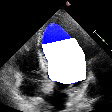
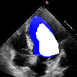
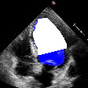

## EchoNet Function Evaluation:<br/>Quantifying Model Variation in Assessing Cardiac Function

An automated end-to-end pipeline for  
1) assessing cardiac function
2) quantifying error in left ventricular ejection fraction calculation with slight clinical perturbations

## Dataset
We simulated errors and ran calculations on 10,032 echocardiogram images which were gathered from EchoNet-Dynamic (https://echonet.github.io/dynamic/)

## Examples
We show examples of our different systematic variation of cardiac function assessment. The error opportunities showcased are over/under tracing of the left ventricle, rotations of main longitudinal axis, foreshortened apex and mitral valve annulus level foreshortening. No human tracings for these patients were used.

| Normal Tracing | Over/Under Tracing | Angle Rotations | Main Axis Foreshortening |
|---------------------------------| ----------------------------------   | -------------------------------- | ------------------------------ |
|  |  |  |  |
|                                              |  |  |  |


## Installation
First, clone this repository and enter the directory by running:
```
git clone https://github.com/douyang/echonet-function-evaluation
cd echonet-function-evaluation
```

EchoNet-Function-Evaluation is implemented for Python 3, and depends on the following packages:
* NumPy
* Matplotlib
* Pandas
* OpenCV
* Pillow
* SciPy
* tqdm

The dependencies can be installed by navigating to the cloned directory and running:
```
pip install --user .
```

## Usage
### Setting Path to Data
By default, the pipeline assumes that a copy of the data is saved in a folder named ```EchoData/``` in this directory. This path can be changed by setting an absolute path in the file named ```data.cfg``` (an example is given in the file already).

### Running Code
The pipeline has two main tasks: assessing cardiac function and quantifying variation on left ventricle ejection fraction calculations. Each of these tasks can be run with the scripts below.

#### Predicting Cardiac Timings
```
cmd="import echofunctions; echofunctions.timing_predictions_CSV.gatherTimingPredictons(inputFolder=\"Videos-Segmented\",
                                                            outputFolder=\"all_frames\", outputCSVName=\"Frame Timing Predictions.csv\")"
python3 -c "${cmd}"
```
We offer a solution to finding the appropriate end-systolic and end-diastolic timings from a given segmented echocardiogram video.

#### Capturing and Creating Frames
```
cmd="import echofunctions; echofunctions.mask.generateMasks(method=\"Simpson\",
                                                      createRawFrames=True)"
python3 -c "${cmd}"
```

This creates two directories named ```frames/``` and ```masks/```, which will contain the raw frames and the masked images from the pipeline, respectively.

#### Calculated Timing against Ground Truth
```
cmd="import echofunctions; echofunctions.timings_against_ground.compareVolumePlot(method=\"Simpson\",
                                                                                    timing="EF")"
python3 -c "${cmd}"
```
This will open and display a plot that will show a scatter plot comparison of the calculated selected timing against ground truth for a given selected method of choice. One can save the plot to their local directory or experiment with matplotlib's GUI.

#### Calculated Method Against Method
```
cmd="import echofunctions; echofunctions.method_against_method.compareVolumePlot(method1=\"Simpson\", method2=\"Biplane Area\",
                                                                                 timing="EF")"
python3 -c "${cmd}"
```
This will open and display a plot that will show a scatter plot comparison of the calculated selected timing using the first method against the second method for a given selected timing of choice. One can save the plot to their local directory or experiment with matplotlib's GUI.
